slide_title: Everything Happens Somewhere: Telling Stories with Maps
custom_css: ./remarkjs/Nord-storm.css
highlight_style: vs
aspect_ratio: 16:9
remarkjs_path: ./remarkjs/remark-0.15.0.js
use_mathjax: true
use_mermaid: true
add_sidebar: true
add_searchbar: true
use_click: false
use_scroll: true
favicon: ./resources/favicon.ico

name: inverse
layout: true
class: center, middle, inverse
---

# Everything Happens Somewhere
------
.round[Telling Stories with Maps]
 
 

 
 
.bold[Dr. Benny CHIN] 
.italic[Lecturer], GIS Unit, Department of Geography, NUS  
.underline[wcchin@nus.edu.sg]  

.headnote.square[18 July 2026 @ FASS Talent Management Outreach]

---
layout: false
class: left, middle
### .smaller.round[About Me] - .smaller.blue[A GISer who teaches Computing in Geography]

.split-50[.column[
Education:  
- 2007-2018: BSc, MSc, PhD, Department of Geography, National Taiwan University

Work Experience:  
- 2019-2024: RF, SUTD & NUS
- 2024-Present: Lecturer, Geography, NUS 

.red.bold[Geospatial Intelligence Cross-Disciplinary Programme (XDP)]

].column[
Teaching: 
- CS1010HS Programming Methodology
- CS2040HS Data Structures and Algorithms
- GE2215 Introduction to .red[GIS]
- GE3238 .red[GIS] Design and Practices
- GE5230 .red[Geospatial] Statistics and Visualisation
- GE5231 .red[Geospatial] Machine Learning
- GE6211 .red[Spatial] Data Science

]]

---
class:center, middle

### Everything Happens Somewhere
 

> .xx-large[Every .red.bold[event] has a .red.bold[location].]  
> .xx-large[Every .red.bold[movement] has a .red.bold[path].]  
> .xx-large[Every .red.bold[problem] has a .red.bold[geography].]

E.g., disease, transport, housing, climate, food, education, inequality, safety, and opportunity.

---
class:center, middle, inverse

## Human Movement 
------
.square[Something we do every day — and something that shapes the city]

---
class:left, bottom
background-image: url(resources/Urban_Flow/Panel_2.png)
background-size: cover

.footnote-right.small[Generated with ChatGPT]

---
class:left, bottom
background-image: url(resources/Urban_Flow/Panel_1.png)
background-size: cover 

.footnote-right.small[Generated with ChatGPT]

---
class:left, bottom
background-image: url(resources/Urban_Flow/Panel_3.png)
background-size: cover

.footnote-right.small[Generated with ChatGPT]

---
class:left, bottom
background-image: url(resources/Urban_Flow/Panel_5.png)
background-size: cover

.footnote-right.small[Generated with ChatGPT]

---
class:left, bottom
background-image: url(resources/Urban_Flow/Panel_6.png)
background-size: cover

.footnote-right.small[Generated with ChatGPT]

---
class:left, bottom
background-image: url(resources/Urban_Flow/Panel_6_b.png)
background-size: cover

.footnote-right.small[Generated with ChatGPT]

---
class: center, middle

### Maps are not just about places
------
They are about RELATIONSHIPS

---
class:left, bottom
background-image: url(resources/Urban_Flow/concept-1.png)
background-size: cover

.footnote-right.small[Generated with ChatGPT]

---
class:left, bottom
background-image: url(resources/Urban_Flow/Panel_7.png)
background-size: cover

.footnote-right.small[Generated with ChatGPT]

---
class: center, middle

#### How COVID-19 Reshaped Urban Mobility and Communities
.split-50[.column[
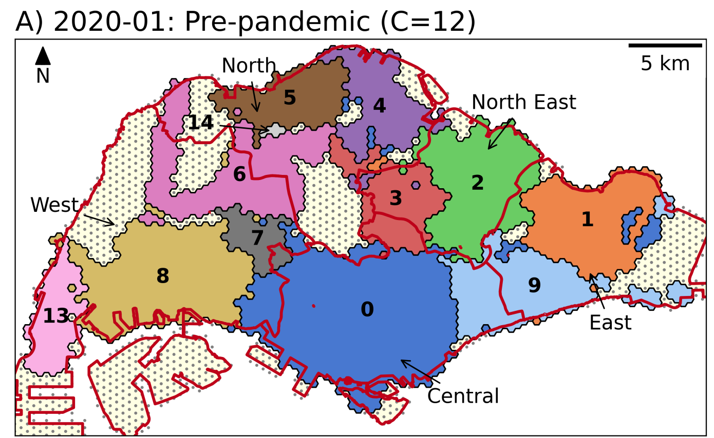
Before COVID-19
].column[
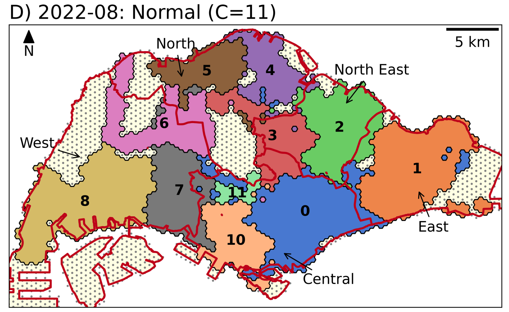
After COVID-19
]]

.footnote-right.smaller[[Chin et al. 2024. The Networked Community of Urban Mobility during the Pandemic](https://doi.org/10.1080/24694452.2023.2278689)]

---
class: center, middle

#### How Communities are Connected
.split-50[.column[
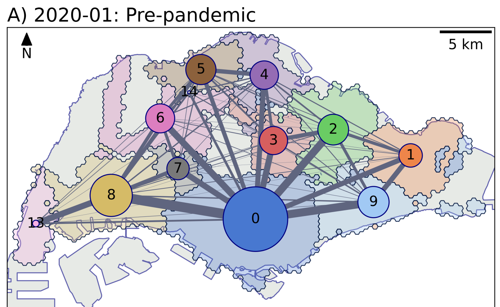
Before COVID-19
].column[
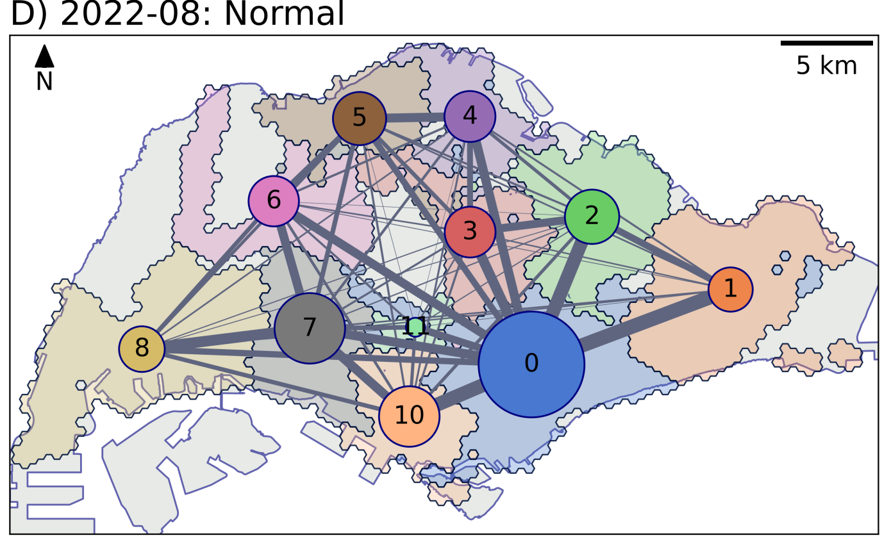
After COVID-19
]]

.footnote-right.smaller[[Chin et al. 2024. The Networked Community of Urban Mobility during the Pandemic](https://doi.org/10.1080/24694452.2023.2278689)]

---
class: left, middle

.split-60[.column[

### What did the network reveal?
Urban structure is not only administrative.
Movement can reveal functional communities.

Some places act as hubs.
They connect different parts of the city.

Some places become more or less connected over time.
Urban structure changes when mobility changes.
].column[

 

.smaller[Photo by <a href="https://unsplash.com/@leo_visions_?utm_source=unsplash&utm_medium=referral&utm_content=creditCopyText">Leo_Visions</a> on <a href="https://unsplash.com/photos/vibrant-cityscape-with-illuminated-buildings-at-night-y4dJcwhgPmc?utm_source=unsplash&utm_medium=referral&utm_content=creditCopyText">Unsplash</a>]
]]

---
class: left, middle

### A city can change without being rebuilt

- Physical city:  
  Buildings, roads, stations, land use.

- Flow city:  
  Trips, movements, interactions, connections.

- Behavioural city:  
  Choices, routines, restrictions, adaptations.

- Dynamic city:  
  Patterns change across time, even when the map looks the same.

.xkcd.red.left[A city is shaped not only by planners and buildings,  
but also by the everyday choices of people.]

---
class: left, middle

### Why this matters

For planners: where should services and transport be improved?

For society: who becomes more or less connected?

For students: how can we use data to understand real-world change?

---
class: center, middle

.bold.xx-large[A map shows where things are. A network shows how places depend on each other.]    
.bold.xx-large[Put them together, and .bold.red[we understand the city more deeply].]

---
class: center, middle, inverse

## The Hidden Geography of NUS
------
.square[How everyday movement creates .bold[interaction] and .bold[disease spread]]

---
class:left, bottom
background-image: url(resources/NUS_wifi/NUS_Map_01.png)
background-size: cover

.footnote-right.small[Mapbox]

---
class:left, bottom
background-image: url(resources/NUS_wifi/AS8_00-crop.png)
background-size: cover

.footnote-right.small[Generated with ChatGPT]

---
class:left, bottom
background-image: url(resources/NUS_wifi/AS8_01b-crop.png)
background-size: cover

.footnote-right.small[Generated with ChatGPT]

---
class:left, bottom
background-image: url(resources/NUS_wifi/AS8_03.png)
background-size: cover
 

.footnote-right.small[Generated with ChatGPT]

---
class: left, middle

.split-40[.column[
### Active user count on campus
].column[
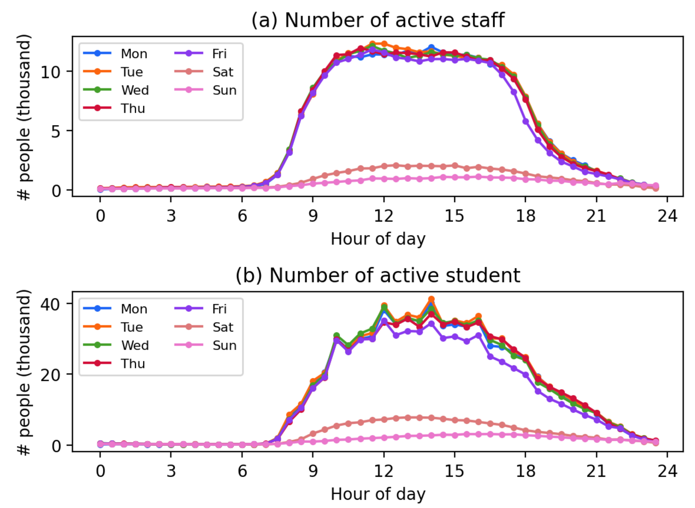
]]

---
class: left, middle

.split-40[.column[
### Interaction count between users on campus
].column[
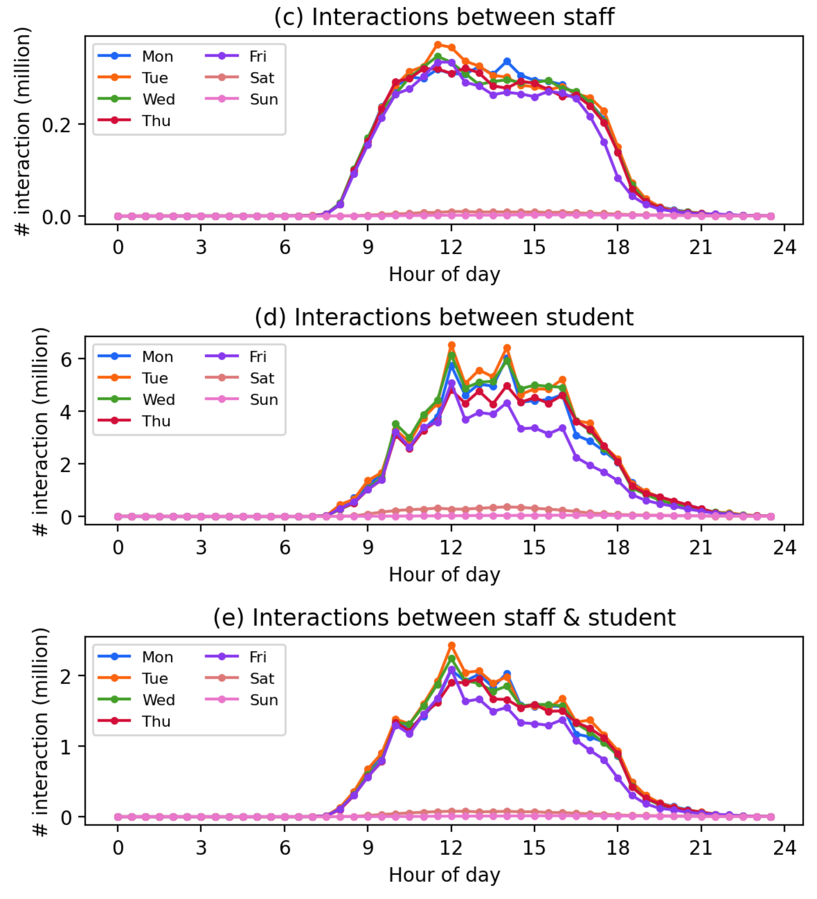
]]

---
class:left, bottom
background-image: url(resources/NUS_wifi/AS8_02-crop.png)
background-size: cover
 

.footnote-right.small[Generated with ChatGPT]

---
class:left, bottom
background-image: url(resources/NUS_wifi/AS8_CLB-extend.png)
background-size: cover
 

.footnote-right.small[Generated with ChatGPT]

---
class: center, middle

### Communities (strong internal flows)

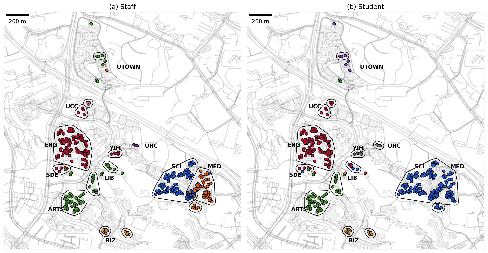

---
class: center, middle

### Connectivity (flows between communities)

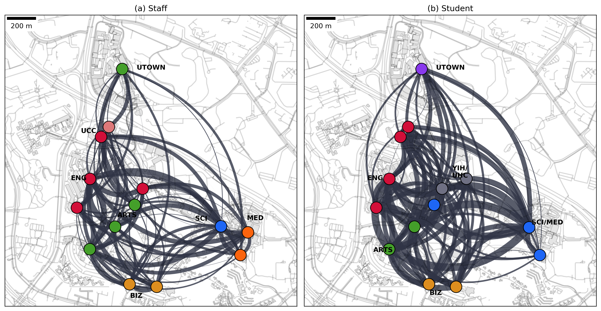

---
class: center, middle

### So what?
------
.square[What can we do with this information?]

---
class:left, bottom
background-image: url(resources/NUS_wifi/co-presence-disease-spreading-comic.png)
background-size: contain

.footnote-right.small[ChatGPT]

---
class:left, bottom
background-image: url(resources/NUS_wifi/simulation.png)
background-size: contain
 

.footnote-right.small[Generated with ChatGPT]

---
class: left, middle

.split-30[.column[
### Disease Spreading Simulation 

SEIR-model, agent-based simulation, 1000 rounds (grey lines) and the average (colored lines). 

].column[
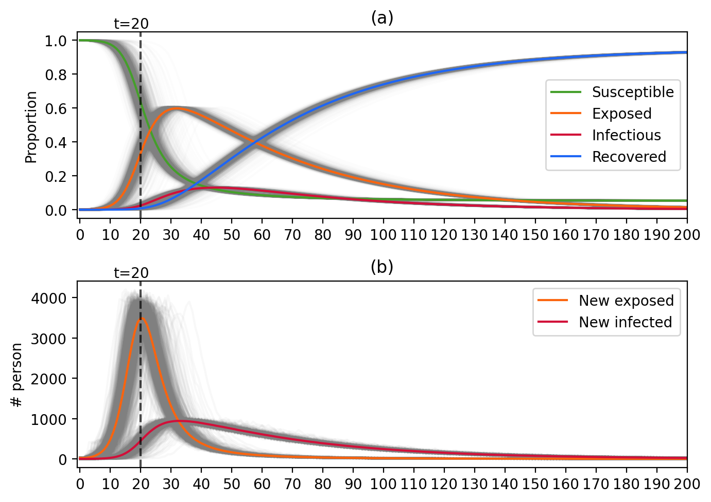
]]

---
class: left, middle

.split-40[.column[

After running the simulation many times, we can identify where people with different outcomes tend to spend time.
Some locations are more associated with people who are infected early, while others are more associated with people who remain uninfected.

- Risk is not evenly distributed.  
- Different places play different roles.  
- Space shapes exposure.  
].column[
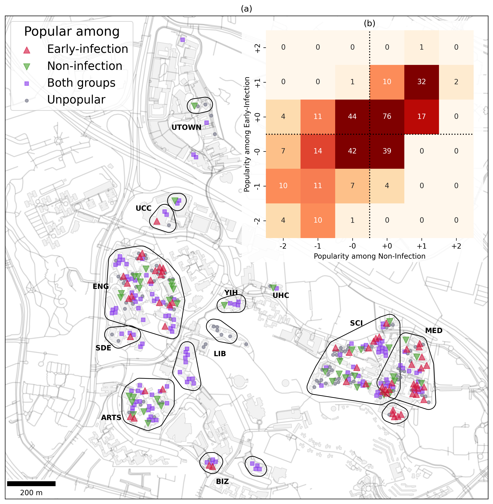

]]

---
class: left, middle

This final map brings the simulation back into space.

After running the model many times, we can identify places that are repeatedly linked to early infection, and places linked to people who remain uninfected.

So the story is not only about disease.

It is also about .red.bold[the geography of everyday campus life].

.red.bold.xx-large[Where people go, where they mix, and how space shapes contact.]

---
class: center, middle, inverse

## One Way of Thinking, Many Worlds
------
.square[See a phenomenon, gather data, analyse it, and map the story.]

---
class: center, middle

### Mapping Different Worlds

From hazards and environments to animals and human activity

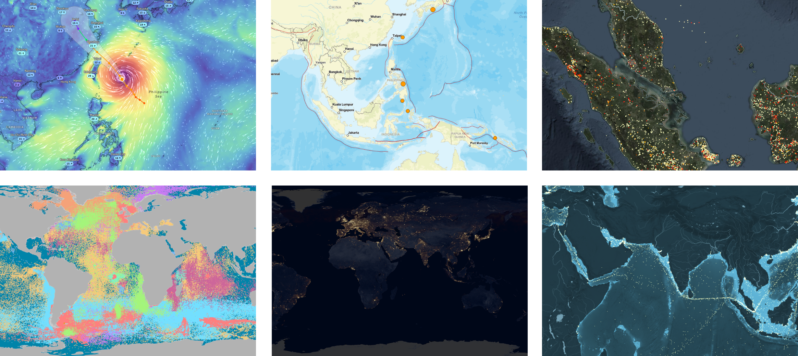

---
class: right, middle
background-image: url(resources/Other/ZoomEarth-wind.png)
background-size: cover

Wind (Typhoon)

.footnote-right.smaller[[Zoom Earth](https://zoom.earth/maps/wind-speed/#view=21.36,124.1,5z/model=icon): https://zoom.earth/]

---
class: center, bottom
background-image: url(resources/Other/USGS-earthquake2.png)
background-size: cover

Earthquake

.footnote-right.smaller[[USGS Earthquake](https://earthquake.usgs.gov/earthquakes/map/?extent=-69.34934,55.89844&extent=71.69129,337.14844&range=search&baseLayer=ocean&timeZone=utc&search={%22name%22:%22Search%20Results%22,%22params%22:{%22starttime%22:%222026-07-07%2000:00:00%22,%22endtime%22:%222026-07-14%2023:59:59%22,%22minmagnitude%22:2.5,%22orderby%22:%22time%22,%22limit%22:500}})]

---
class: center, top
background-image: url(resources/Other/NASA-FIRMS-fire.png)
background-size: cover
 

Fire Event

.footnote-right.smaller[[NASA-FIRMS](https://firms.modaps.eosdis.nasa.gov/map/?utm_source=chatgpt.com#t:tsd-daily;d:2026-06-11..2026-07-10;l:fires_all,country-outline,firefly;@108.5,1.8,6.4z)]

---
class: right, top 
background-image: url(resources/Other/Seabird_Tracking_Database_Map_noBorders.jpg)
background-size: cover
 

Seabird Tracking

.footnote-right.smaller[[Seabird Tracking
Database](https://www.seabirdtracking.org/): https://www.seabirdtracking.org/]

---
class: left, bottom
background-image: url(resources/Other/earths-city-light.png)
background-size: cover

Earth's City Lights

.footnote-right.smaller[[Blue Marble - Night Light](https://blue-marble.de/nightlights/)]

---
class: center, top
background-image: url(resources/Other/shipmap.png)
background-size: cover

Ship Map

.footnote-right.smaller[[Ship Map](https://www.shipmap.org/): https://www.shipmap.org/]

---
class: center, middle, inverse

## The Computer Lesson
------
.square[Will Everyone Work in AI?]

---
class: left, middle
 
.split-70[.column[

### The Computer Lesson
In the 1990s, many people worried that computers would replace human work.

But today, most jobs did not disappear.

Instead, computers became part of everyday work.

Office workers use computers.  
Teachers use computers.  
Researchers use computers.  
Taxi drivers and delivery workers use digital devices.

.red.bold.xx-large[The computer became a tool for almost everyone.]

].column[

.footnote-right.smaller[Photo by <a href="https://unsplash.com/@knguyenmapc?utm_source=unsplash&utm_medium=referral&utm_content=creditCopyText">Kimberly Nguyen</a> on <a href="https://unsplash.com/photos/a-row-of-old-computers-sitting-on-top-of-a-desk-QVuBdXk-07I?utm_source=unsplash&utm_medium=referral&utm_content=creditCopyText">Unsplash</a>]

]]

---
class: left, middle

### If we group jobs by how they use computers

- Tier 1 (T1) — .bold[General Computer User]  
  Uses .red[common digital tools] for everyday work  
  e.g.: email, web browsing, Microsoft Office

- Tier 2 (T2) — .bold[Computational Proficiency]  
  Uses .red[specialised software] for a particular field  
  Examples: ArcGIS, AutoCAD, Adobe Illustrator 

- Tier 3 (T3) — .bold[Computing Profession]  
  .red[Builds] software, systems, models, or other .red[computing-based solutions]  
  Examples: software development, data engineering, AI development

- Computer-using (CU) — T1 + T2 + T3 

---
class: center, bottom
background-image: url(resources/AI-work/computer-using.png)
background-size: contain

Computer-using (CU) / Total workforce (W)

.footnote.smaller[[Global Computing Workforce](https://gix-academy.github.io/FASS-TMO-2026/resources/AI-work/global_computing_workforce_map_v3.html)]

.footnote-right.small[Generated with Claude]

---
class: center, bottom
background-image: url(resources/AI-work/computing-profession.png)
background-size: contain

Computing Profession (T3) / Total workforce (W)

.footnote.smaller[[Global Computing Workforce](https://gix-academy.github.io/FASS-TMO-2026/resources/AI-work/global_computing_workforce_map_v3.html)]

.footnote-right.small[Generated with Claude]

---
class: center, bottom
background-image: url(resources/AI-work/proportion.png)
background-size: contain

Computing Profession (T3) / Computer-using (CU)

.footnote.smaller[[Global Computing Workforce](https://gix-academy.github.io/FASS-TMO-2026/resources/AI-work/global_computing_workforce_map_v3.html)]

.footnote-right.small[Generated with Claude]

---
class: left, middle 

#### Far more people use computers in their work than develop computing technologies.

| Region | Total Workforce (W) | Computer-Using (CU/W) % |  Computational Proficiency (T2/W) % | Computing Profession (T3/W) % | T3/CU % |
|---|---:|---:|---:|---:|---:|
| **Singapore** | **3.6M** | **90.0%** | **10.0%** | **5.8%** | **6.4%** |
| Europe | 388M | 67.3% | 9.1% | 4.2% | 6.2% |
| North America | 239M | 68.2% | 9.2% | 3.8% | 5.6% |
| Asia | 1,929M | 36.6% | 4.7% | 2.0% | 5.5% |
| **Global** | **3,364M** | **41.3%** | **5.4%** | **2.2%** | **5.3%** |

.footnote-right.smaller[Estimates compiled from cited international datasets with AI assistance; Singapore figures are estimated from IMDA data.]

---
class: left, middle

### AI May Follow a Similar Path

.split-60[.column[

The arrival of computers did replace some jobs, but it did not destroy the job market. It reshaped the entire .bold.red[employment ecosystem].

Some jobs disappeared. New jobs emerged. Most jobs changed because computers became part of how work was done.

AI is likely to do the same: .red.bold[not simply replace jobs, but reshape the future of work.]

].column[

]]

---
class: left, middle

.split-80[.column[
### A New Blue Ocean

The three maps and the table show what this transformation looks like in Singapore today. Around 90% of jobs involve the use of computers, yet fewer than 10% of positions are in core computing professions.

That means the largest opportunities are not limited to becoming a computer scientist or AI engineer. They lie across the wider economy, .red.bold[where people combine computing and AI with knowledge of geography, business, healthcare, design, policy, education, and many other fields.]

].column[

.footnote-right.smaller[Photo by <a href="https://unsplash.com/@sotti?utm_source=unsplash&utm_medium=referral&utm_content=creditCopyText">Shifaaz shamoon</a> on <a href="https://unsplash.com/photos/body-of-water-on-beach-shore-9K9ipjhDdks?utm_source=unsplash&utm_medium=referral&utm_content=creditCopyText">Unsplash</a>]
]]

---
class: left, middle

.split-30[.column[

.footnote-left.smaller[Picture by rawpixel on <a href="https://www.magnific.com/free-photo/robot-handshake-human-background-artificial-intelligence-digital-transformation_17850420.htm#from_element=cross_selling__photo">Magnific</a>]

].column[

The future is not only about working .red.bold[on AI].

It is also about working .red.bold[with AI] across different fields.

Just as computers became essential tools across almost every profession, AI may become part of how many kinds of work are done.

The future needs not only people who build AI, but .red.bold[people who know what problems are worth solving with it.]
]]

---
class: center, middle, inverse

## GIX, Geography & FASS
------
.square[A new blue ocean: using AI beyond computing]

---
class: left, middle 

.xx-large[The bigger opportunity is .red.bold[learning how to apply computational technologies to real-world problems.]]

Geography is one of the fields where this matters most.

Because .bold[every real-world problem] happens somewhere.

.split-50[.column[
.bold[.red[Where] is it happening?]

.bold[.red[How] is it changing?]
].column[
.bold[.red[Who] is affected?]

.bold[.red[What] should we do next?]
]]

.xkcd.bold.xx-large[Geography gives these questions .red[a place, a context, and a human meaning].]

---
class: left, middle 

### Why Geospatial Intelligence XDP (GIX)?

.split-70[.column[

GIX brings together:

.red.bold[Geography] — understanding people, places, and environments

.red.bold[Computing] — working with data, models, and systems

.red.bold[AI] — detecting patterns and supporting decisions

.red.bold[Human judgement] — asking better questions and acting responsibly

.bold.red[Geography × Computing for real-world problems]

].column[

]]

---
class: right, top
background-image: url(resources/gix/gix-applications.png)
background-size: cover

<!--
Example applications
-->

.headnote.smaller[[https://gix-academy.github.io/welcome](https://gix-academy.github.io/welcome/)]
 
---
class: right, top
background-image: url(resources/gix/gix-nutshell.png)
background-size: cover

<!--
GIX in a nutshell
-->

.headnote.smaller[[https://gix-academy.github.io/welcome](https://gix-academy.github.io/welcome/)]

---
class: center, middle

## Everything Happens Somewhere

Wherever you go, learn to

.card-container[
.card[
  .card-icon[
    <i class="typcn typcn-location-outline"></i>
  ]
  .card-label[Find where]
]
.card[
  .card-icon[
    <i class="typcn typcn-zoom-outline"></i>
  ]
  .card-label[Understand why]
]
.card[
  .card-icon[
    <i class="typcn typcn-compass"></i> 
  ]
  .card-label[Decide what comes next]
]
]

.xkcd.xx-large.bold[The .red[next important story] is waiting for you to map it.]

---
class: center, middle

### More about Geography and GIX

.card-container[
.card[

  .card-label[Department of Geography]
]
.card[

  .card-label[Geospatial Intelligence XDP] 
]
]
